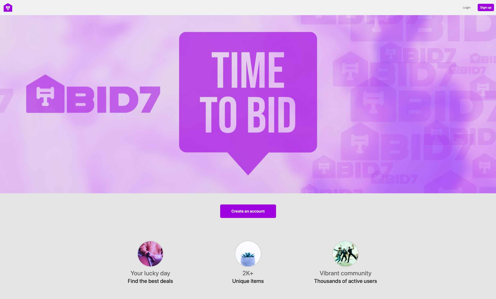

# BID7 Aution Platform

## Semester Project 2

Norwegian School of Technology and Digital Media, Noroff

## Summary

An auction site is looking to launch a website where users can add items to be bid on and bid on items other users have put up for auction. When a new user joins the website, they are given 1000 credits to use on the site. They can get credits by selling items and use credit by buying items. Non-registered users can search through the listings, but only registered users can make bids on listings.

- Version: 1.2.0
- 

## Built with

- Adobe XD
- HTML
- Bootstrap
- SASS
- Vanilla Javascript
- git
- VS Code
- [Noroff API](https://docs.noroff.dev/)

  
  &nbsp;
  &nbsp;
  &nbsp;
  
  

## User stories

- [x] The client has specified the following requirements in the form of User Stories:
- [x] A user with a stud.noroff.no email may register
- [x] A registered user may login
- [x] A registered user may logout
- [x] A registered user may update their avatar
- [x] A registered user may view their total credit
- [x] A registered user may create a Listing with a title, deadline date, media gallery and description
- [x] A registered user may add a Bid to another user’s Listing
- [x] A registered user may view Bids made on a Listing
- [x] A registered user may use credit to make a Bid on another user’s Listing
- [x] An unregistered user may search through Listings

## Required links

The Product Owner has requested links to the following:

- [A Gantt chart for project timing](https://www.jottacloud.com/s/13959e5672009894be2ae09ef04fafa0c9c)
- A design prototype
- A style guide
- [A kanban project board](https://trello.com/b/iXKIkHhy/bid7-dev)
- [A repository link](https://github.com/NehGuk/bid7)
- [A hosted application demo link](https://magenta-llama-b35046.netlify.app/index.html#)

## Instructions

- `npm install`: Starts node and installs dependencies
- `npm build`: Compiles CSS
- `npm watch`: Compiles src/scss/style.scss to dist/css/style.css (SASS watches for changes).

## Dependencies

- Bootstrap 5.2.2
- SASS 1.56.1

## Contributions

For suggestions and contributions, please fork this repository and open new pull requests. The main branch is protected. You're also welcome to post post on the [issues](https://github.com/NehGuk/bid7/issues) tab.
